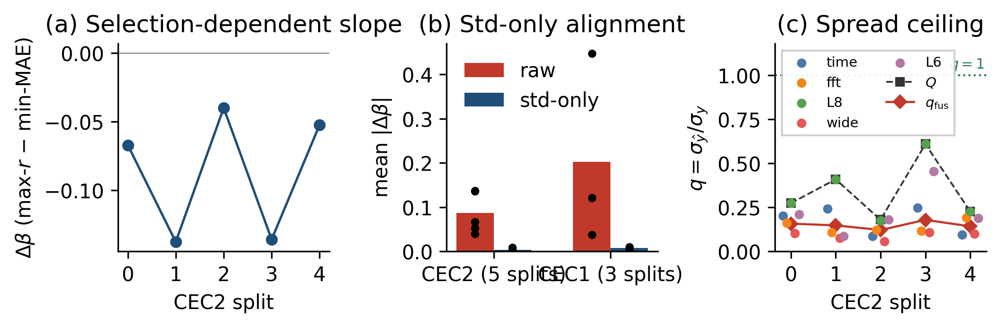
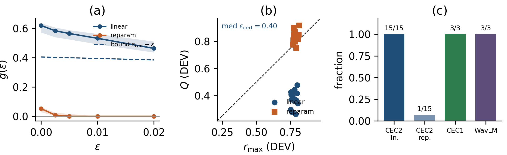
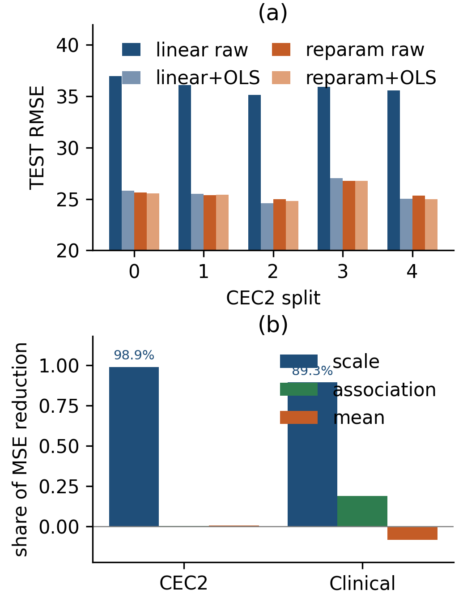

# Scale misidentification in correlation-based intelligibility fusion

Reproduction code and locked aggregate results for the ICASSP paper:

> **Scale Misidentification in Correlation-Based Intelligibility Fusion**
> Kai Wang, Yuxiang Zhang, Jiwu Liu, and Qin Gong

[](LICENSE)

[](https://github.com/wangkai-oss951/scale-misidentification-fusion/actions/workflows/ci.yml)
[](https://colab.research.google.com/github/wangkai-oss951/scale-misidentification-fusion/blob/main/notebooks/quickstart.ipynb)

No Clarity/CPC2 audio and no clinical recordings are needed: every headline number
is checked against the released aggregate JSON in one command.

## What the paper contributes

1. **Output scale is non-identifiable under correlation-selected convex fusion.**
   On the simplex, `w ↔ π` is a bijection, so equal-quality fusions can carry very
   different absolute scale; selecting by Pearson leaves that scale free.
   → evidence: `paper_tables.json:identifiability_closure` (≤ 2.1e-15),
   `scripts/optimize_simplex.py`.

2. **A DEV margin is a near-optimal unattainability certificate with a uniform error
   floor.** With `ε_cert = r_max − Q`, Cor. 2 gives `g(ε) ≥ ε_cert − ε`, so near-max-`r`
   weights sit at a bounded distance `σ_y²(ε_cert − ε)²` from MSE optimality.
   → evidence: `p0_near_maxr_frontier.json` — linear 15/15 at `ε=.01`,
   median `ε_cert = 0.404`, median numerical `g(.005) = 0.565` against the floor
   `0.399`; the matched reparameterization keeps only 1/15. Reproduced by
   `scripts/reproduce_fig2.py` and `scripts/certificate.py`.

3. **Raw simplex weights are coordinate-dependent and are not scale-free importance.**
   Positive component-wise affine units leave `π` and `r` at machine precision while
   the raw weights move substantially.
   → evidence: `paper_tables.json:unit_change_example`,
   `p0_matched_ols_headroom_table.json`.

**Not claimed.** Pearson invariance is a known fact, not a contribution; the scale gap
is *not* caused by the correlation objective alone; the reparameterization control is
not a new algorithm; CCC and variance-collapse framings are excluded; `hits`/`n_words`
are likelihood labels only. See `docs/EVIDENCE.md`.

## Reproduce in one command

```bash
python -m pip install -r requirements.txt
python scripts/verify_paper_numbers.py --config configs/cec2.yaml
```

Expected tail (79 checks, all `[PASS]`):

```text
[PASS] median eps_cert (linear)  (got 0.404350240734 expected 0.404350240734)
[PASS] median numerical g(.005)  (got 0.564652910609 expected 0.564652910609)
[PASS] Cor.2 holds system-wise (15/15 at eps=.005)  (min slack 0.0665)
[PASS] census Kendall tau (r vs RMSE)  (got 0.0188488042156 expected 0.0188488042156)
[PASS] census pairwise rank-inversion rate  (got 0.509424402108 expected 0.509424402108)
[PASS] census raw/uncalibrated q<r count  (got 61 expected 61)
[PASS] census Spearman rho ((q-r)^2 vs G_aff)  (got 0.814123181796 expected 0.814123181796)
[PASS] clinical seed-wise mean G_q  (got 0.726806256935 expected 0.726806256935)

79/79 checks passed
```

The census statistics quoted in the paper are all in
`results/paper_locked/p0_census_scale_landscape.json`:

| Quoted in the paper | JSON key | Value |
|---|---|---|
| Kendall τ = 0.019 | `comparable.kendall_tau_r_rmse` | 0.0188488 |
| pairwise inversion 0.51 | `comparable.rank_inversion_rate` | 0.5094244 |
| 63-system subset | `vector_G_aff.n` | 63 |
| Spearman ρ = 0.81 | `vector_G_aff.spearman_qr2_Gaff2` | 0.8141232 |
| 61/74 (82.4%) explicitly raw | `by_calibration_status.explicitly_raw_uncalibrated` | n=74, q<r=61 |
| 61/77 (79.2%) unfiltered | `comparable.n_with_q`, `comparable.frac_q_lt_r` | 77, 0.7922078 |

Figures and tables:

```bash
python scripts/reproduce_fig1.py --config configs/cec2.yaml
python scripts/reproduce_fig2.py --config configs/cec2.yaml
python scripts/reproduce_fig3.py --config configs/cec2.yaml
python scripts/reproduce_tables.py --config configs/cec2.yaml
```

A synthetic five-head set (no Clarity data, exhibiting `Q < r_max`) exercises the full
optimizer → certificate path:

```bash
python scripts/make_example_data.py
```

Expected highlights — the same quantities the paper reports, on synthetic heads:

```text
DEV r_max, Q, eps_cert 0.9470 0.3946 0.5525
g(.005) numerical 0.8071  Cor.2 floor 0.5475
within-listener residual Q<r_max-0.01 True
```

(`Q < r_max` holds, the numerical frontier clears the Cor. 2 floor, and the DEV-only
std alignment removes the DEV certificate — the same qualitative behaviour as the paper,
on data that can be redistributed.)

## Figures

Regenerated from the locked aggregates by the scripts above. Styling differs from the
camera-ready version; the numbers do not.

### Fig. 1 — what the selection objective does to the slope



(a) The selection objective moves the output slope `β`: max-`r` vs min-MAE differs
directionally in 5/5 CEC2 splits. (b) DEV-only standard-deviation alignment removes
`|Δβ|` on CEC2 and CEC1, while mean-only alignment does not. (c) Heterogeneous head
spreads keep the fusion below the spread ceiling `Q`, so the convex simplex cannot
recover the lost dynamic range. `scripts/reproduce_fig1.py`, `scripts/std_alignment.py`,
`scripts/scale_metrics.py`.

### Fig. 2 — the certificate and the near-max-`r` floor



(a) Numerical `g(ε)` sits above the Cor. 2 floor `ε_cert − ε` at every `ε` (per-system
slack at `ε=.005` is at least 0.0665). (b) `Q` versus `r_max` on DEV, with the median
`ε_cert = 0.404`. (c) Certificate rates: CEC2 linear 15/15, matched reparameterization
1/15, CEC1 3/3, cross-encoder WavLM 3/3. `scripts/reproduce_fig2.py`,
`scripts/certificate.py`.

### Fig. 3 — affine headroom and where the MSE reduction comes from



(a) Matched DEV-OLS affine headroom is large for raw fusion (8.91–11.15) and gone once
the scale is pinned by the reparameterization (−0.02–0.35). (b) The MSE reduction is
scale-dominated: 98.9% on CEC2 and 89.3% on the clinical corpus (mean of seed-wise
shares). `scripts/reproduce_fig3.py`, `scripts/affine_headroom.py`.

## Claim → code → result

| Paper element | Module | Locked result it reads |
|---|---|---|
| Simplex max-`r` / min-MAE | `scripts/optimize_simplex.py` (paper SLSQP, not a rewrite) | `p0_e2e_split.json` |
| `r_max`, `Q`, `ε_cert`, `g(ε)` | `scripts/certificate.py` | `p0_near_maxr_frontier.json` |
| Fig. 1a/1b/1c | `scripts/reproduce_fig1.py`, `scripts/std_alignment.py` | `p0_e2e_split.json`, `p0_mechanism_locked_protocol.json`, `p0_cec1_mechanism_replication.json`, `p0_spread_bound_table.json` |
| Fig. 2 | `scripts/reproduce_fig2.py` | `p0_near_maxr_frontier.json`, `paper_tables.json` |
| Fig. 3a affine headroom | `scripts/affine_headroom.py` | `p0_matched_ols_headroom_table.json` |
| Fig. 3b MSE shares | `scripts/scale_metrics.py` (`mse_terms`) | `paper_tables.json` |
| Tables 1–2 | `scripts/reproduce_tables.py` | `paper_tables.json`, `p0_near_maxr_frontier.json`, `p0_clinical_mse_decomp.json`, `p0_within_group_barrier.json` |
| Within-listener / within-scene | `scripts/residualize.py` | `p0_within_group_barrier.json` |
| Archived-census rank agreement (τ, inversion, n=63, ρ) | `scripts/verify_paper_numbers.py` | `p0_census_scale_landscape.json` |
| Census prevalence 61/74 vs unfiltered 61/77 | `scripts/verify_paper_numbers.py` | `p0_census_scale_landscape.json` (`by_calibration_status`) |
| Cross-check of every number above | `scripts/verify_paper_numbers.py` | all of `results/paper_locked/` |

Exact key paths for each claim are listed in [`docs/EVIDENCE.md`](docs/EVIDENCE.md).

## Repository layout

```text
configs/           cec2.yaml (paper aggregates), example.yaml (synthetic demo)
scripts/           optimizer, metrics, certificate, alignment, figures, tables, verify
results/paper_locked/   locked aggregate JSON used in the manuscript
data/example/      schema.csv; synthetic npz is generated on demand
docs/              EVIDENCE.md, figures/
notebooks/         quickstart.ipynb (Colab)
```

## Using your own five-head matrices

Store `P` as shape `(k, n)` (component predictions) with a DEV index, then:

```bash
# PowerShell
$env:PYTHONPATH = "scripts"
# bash
export PYTHONPATH=scripts
```

```python
from certificate import certificate_quantities, numerical_frontier

cert = certificate_quantities(P[:, dev], y[dev])
g = numerical_frontier(P[:, dev], y[dev], cert["r_max"], eps=0.005)
```

Moments are population moments (`ddof=0`). `β = Cov(y, ŷ)/Var(y)` is an OLS prediction
slope, not a calibration slope. `q = σ_ŷ/σ_y = β/r`.

## Data and privacy

Released: analysis code, synthetic examples, the field schema, and the locked aggregate
JSON. **Not** released: CEC2/CEC1 waveforms, official CPC2 labels, clinical audio,
identifiers, or clinical prediction vectors. Clinical evidence in the paper is a
single-head `raw768_time` person-holdout; the released clinical numbers are aggregate
`r, q, RMSE, β` and MSE-term shares only. To retrain heads, obtain Clarity/CPC2 and the
clinical corpus from their own providers under their terms.

## Citation

See [`CITATION.cff`](CITATION.cff). If you build on the certificate or the error floor,
please cite the paper (add the DOI/arXiv id once available).

## License

MIT for the code and the released aggregate tables. Clarity/CPC2 and the clinical corpus
remain under their original terms.

## 中文说明

本仓库只开源**分析代码**、合成示例、字段说明和论文锁定的**汇总 JSON**；不公开临床原始
数据、音频、可识别 ID，也不公开各头的预测向量。审稿人只需一条命令即可核对论文数字：

```bash
python scripts/verify_paper_numbers.py --config configs/cec2.yaml
```

逐条「论文结论 → 文件 → 关键字段」的对照见 `docs/EVIDENCE.md`。simplex 优化器是论文里
实际使用的 SLSQP 实现，不是近似改写。临床部分是单头 `raw768_time` 留人验证，`Q` 与
`r_max` 是五头融合可行集的概念，刻意**不**套用到临床语料。
